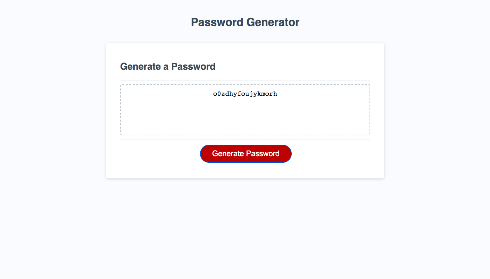

# password-generator

## Description

This weeks challenge was to use javascript to generate a password when the button is clicked. The conditions of the challenge were: ensure that the password length was between 10 to 64 characters, and prompt the user to select their desired length of password, to prompt user if they wanted to include lowercase, uppercase, numbers or special characters in their password and lastly, to validate for each input and at least one character type should be selected. Once all prompts have been answered, the generated password is displayed.
This challenge was paticularly interesting because it required clear planning before starting the task. To begin, I began writing pseudo code, to help me undertsand how to plan and break down each criteria of the challenge. The pseudo code also helped me plan where I will put my written code in the starter file. This challenge also taught me new functions such as getrandom() and how to use while loops. The hardest part of the challenge was to make sure that the special criterias selected in the password were included in the final generated password, which I have done by creating a random variable for each condition and adding it to the password. 

## Usage

To use the site, click on the button that says 'generate password'. A series of prompts will then pop up asking how long you would like the password and what other characters you may want to add. For the first prompt, the password length, enter a number between 10 and 64. If the password is too long or too short, or you have entered something that is not a number, you will be alerted to input another number. After, select what characters you would like to add to the password. Once all prompts have been answered, a random password meeting the criteria will be generated and displayed.

Here is a link to the github repo: https://github.com/shazzy-kawa/password-generator.git
Here is a link to the deployed page: https://shazzy-kawa.github.io/password-generator/

## Credits

This challenge was completed using the bootcamp resources.

## License

This was completed using an MIT license

